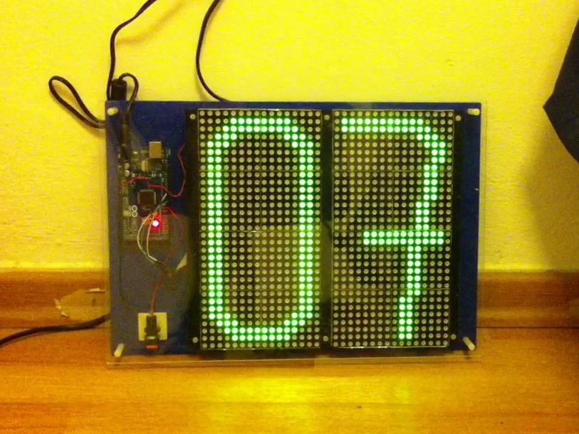

60 Seconds Clock LED Matrix
==========================

60 seconds clock using 2 32x16 LED matrix board from Sure Electronics and an Arduino MEGA / ESP32.

Using the library "HT1632 for Arduino" (https://github.com/flavio-fernandes/HT1632-for-Arduino)
